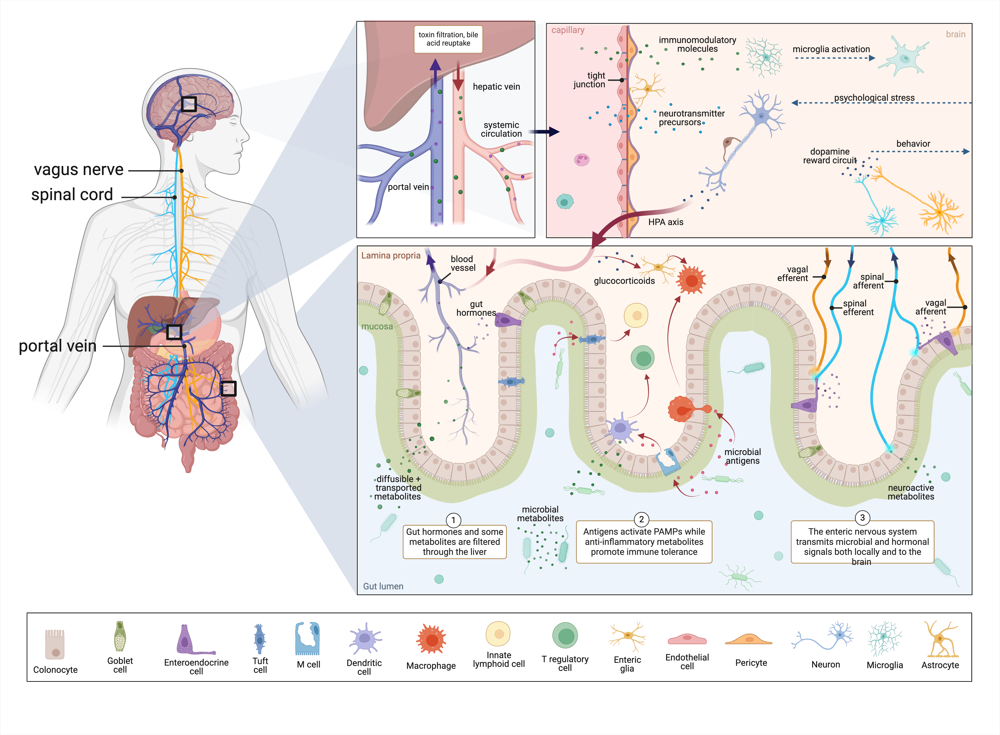
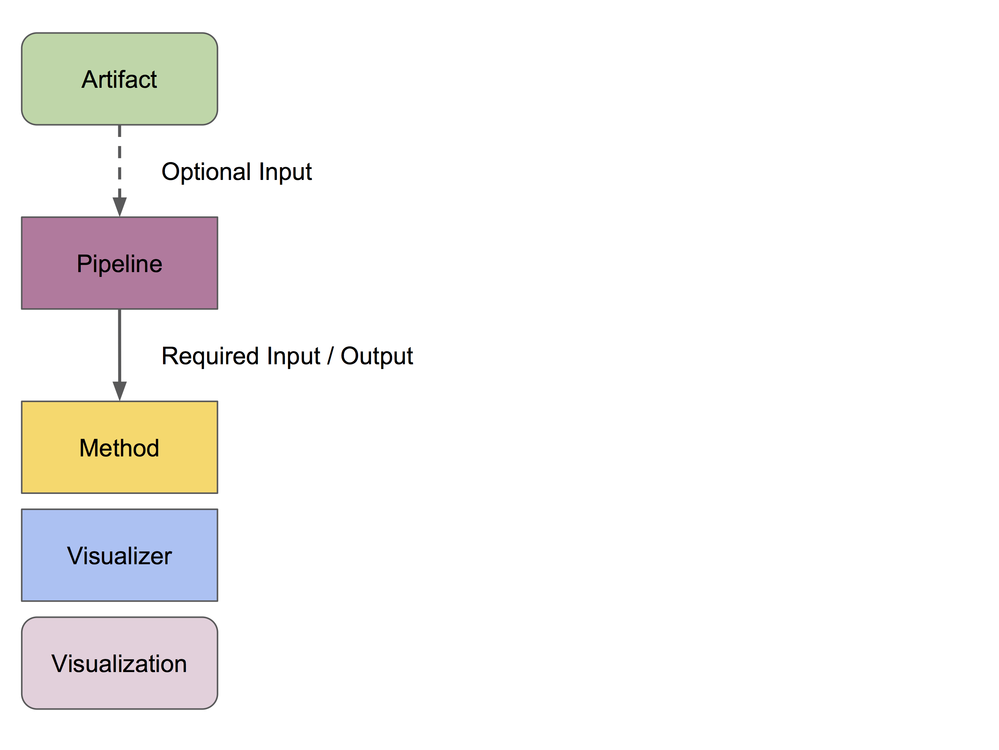
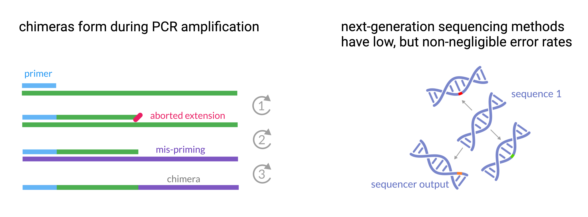
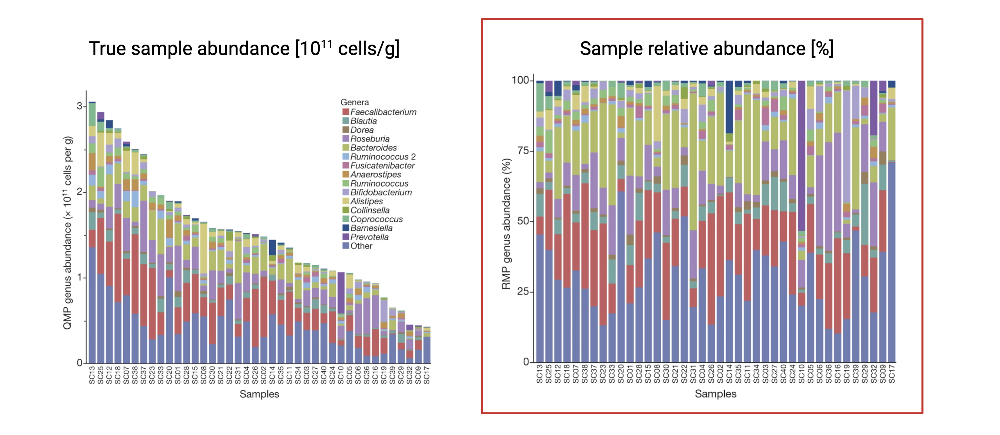
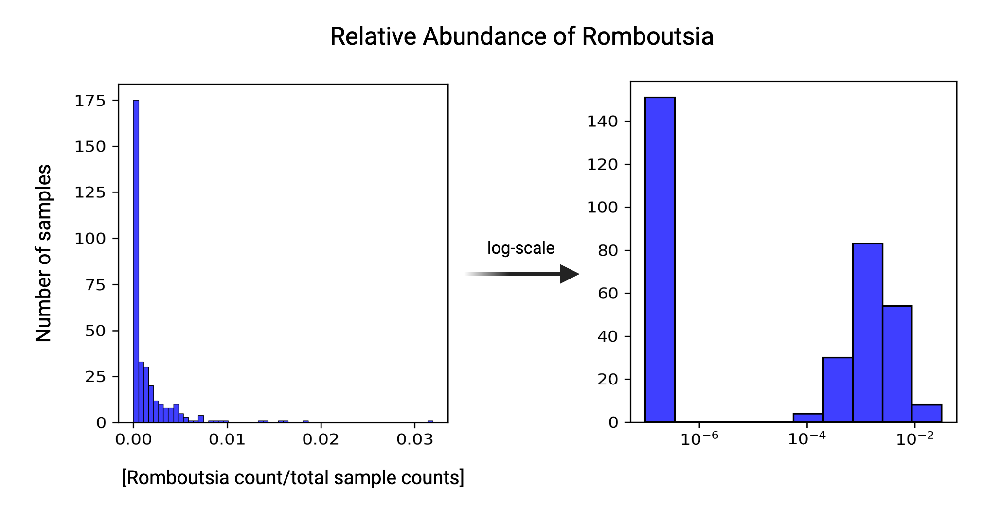
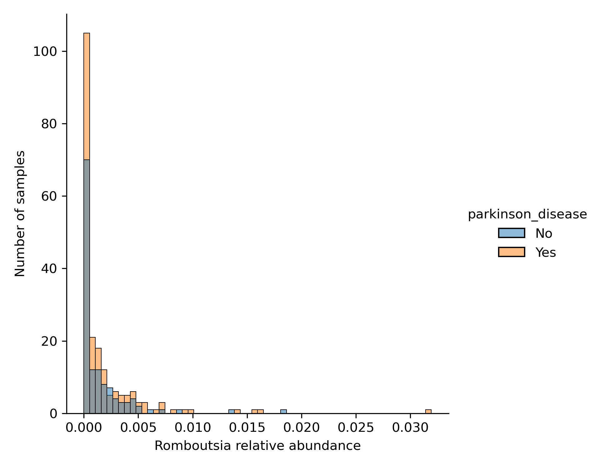
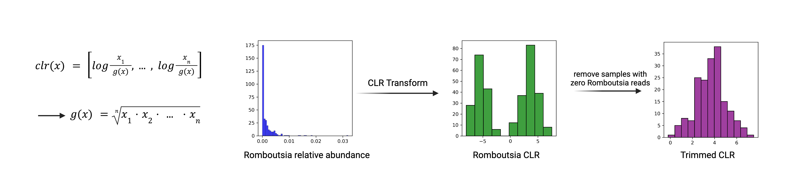
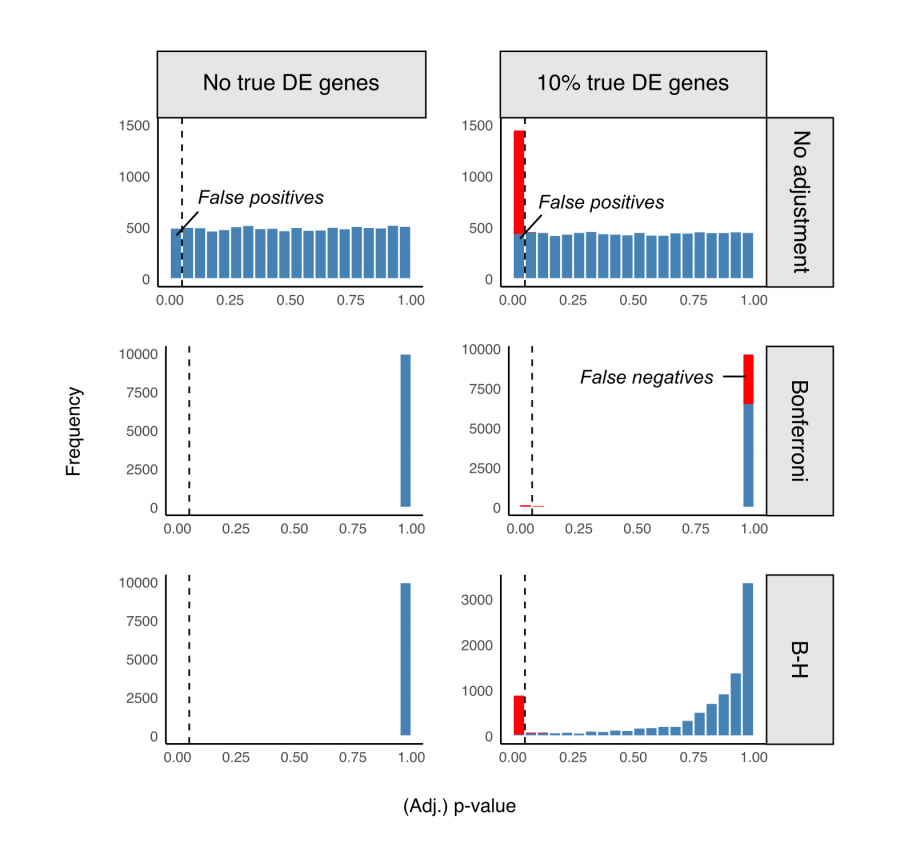
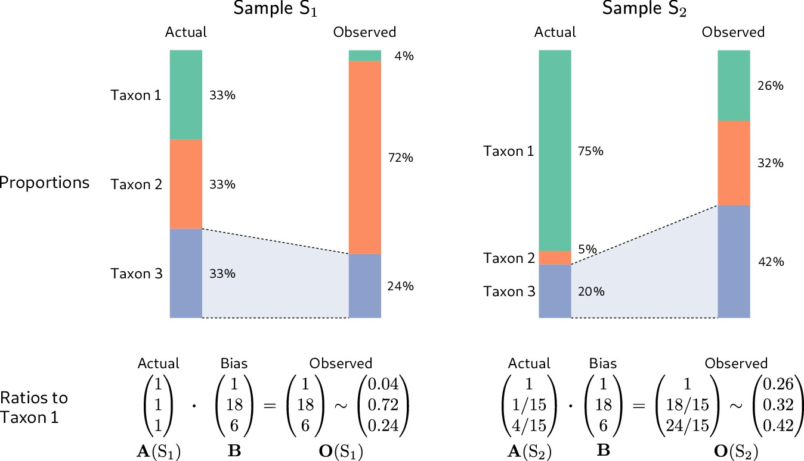

<!-- .slide: data-background="assets/isb/data-midnight.jpg" class="dark" -->

# Amplicon Sequencing Data Analysis with QIIME 2

### Alyssa Easton, Gibbons Lab

from the *ISB Microbiome Course 2024*

 

<a href="https://creativecommons.org/licenses/by-nc/4.0/"><i class="fa fa-bullhorn"></i>CC-BY-NC</a>
<a href="https://gibbons.isbscience.org/"><i class="fa fa-globe"></i>gibbons.isbscience.org</a>
<a href="https://github.com/gibbons-lab"><i class="fa fa-github"></i>gibbons-lab</a>

Note:
Welcome everyone to the first day of the ISB Microbiome Series for this year. As Sean mentioned, my name is Alyssa Easton, and I’m a graduate student in the Gibbons Lab. I’ll be your instructor for today’s part of the course. I’m so glad you could join us today, and I hope you’ll also stay for the wonderful talk later, as well as for the next two days of the series. We have another part of the course tomorrow, and we’ll finish up on Friday with a symposium featuring several exciting talks from prominent researchers in the field.

---

## Let's Start Learning :books:

First, we'll need the slides, full of _digestible_ information

*https://gibbons-lab.github.io/isb_course_2024/16S*

Note: 
The first thing you’ll need is the slides I have open. These slides are available in the introductory email you received, and the TAs will also post a link to them on the Slack channel soon, if they haven’t already. I encourage you to open the slides and follow along during the instruction, and to go back through them later if you need a refresher. If you have any trouble opening the slides, please let the TAs know on Slack. They’ll be happy to help you find them.

---

<!-- .slide: data-background="var(--primary)" class="dark" -->

# Organization of the course

Note: 
Let’s quickly touch on how the course is organized. As in previous years, there are three main components:
First, we have the lecture slides. These contain the theoretical background and logic behind the methods we’ll cover today, with explanations and links to additional resources for you to explore later.
Second, we have the interactive course notebook. This notebook is where we’ll handle the technical aspects of the course. You’ll be able to follow along as we process and analyze data in real time, generating visualizations that help us learn about the dataset.
Lastly, we have Slack. You should have already accessed the Slack channel via the introductory email or the Zoom link. This is a great resource for asking questions or getting technical support. While the Zoom chat won’t be monitored as actively, the Slack channel will have several TAs available to assist you.

---

## Guts, Camera, Action :movie_camera:

📕 Let's switch to the notebook and get started. Step 1: save a copy of this notebook in your Google Drive.

 

In case you get lost, *all* output we generate can be found on [Github](https://github.com/Gibbons-Lab/isb_course_2024/tree/main/treasure_chest), or in `materials/treasure_chest` in Colab.

Note: 

To follow along in the notebook, the link to access it is in the email and on Slack. Go ahead and click the link to open the notebook and get set up. I’ll give you all a moment to do that. Once it’s open, you should see something like this… This is the interactive notebook we’ll be using to run through the data analysis today.
Before we begin, I recommend making a copy of the notebook in your Google Drive. This will allow you to save your work and return to it later. To do that, go to the toolbar on the top left, click File, and about halfway down, you’ll see an option that says Save a copy in Drive. Click that. If you aren’t logged into Google yet, you might be prompted to do so. Once it’s saved, you’ll see a label on the top left that says ‘Copy of The Notebook.’ Feel free to rename it to something more meaningful, like ‘Alyssa_16S,’ or however you’d like.

Now that you’ve saved a copy of the notebook in your Google Drive, let’s take a moment to understand what we’re looking at. The notebook is a tool that allows you to run through the data analysis in real time. It’s divided into different cells—some contain text, like this introduction, while others contain code that we’ll run. The code cells are slightly darker and have a play button on the left-hand side.

Let’s get familiar with the interface. On the left-hand side, you’ll see four icons. The first one opens a table of contents, which will give you a general workflow of what we’ll be working through today. The last icon down here is the file directory, which is where we’ll find the files we need for the course.

Right now, you’ll see that there’s only some sample data in the directory. We won’t be using this, so let’s load the actual course materials. The first code cell we’ll run will copy all the materials we need directly from GitHub into the notebook. You’ll notice that many of the commands start with an exclamation point (!). This tells the notebook to treat the code as a command line action, rather than standard Python code.

Go ahead and run that cell now, and the materials will be copied to the Google Colab server. This shouldn’t take more than a few seconds. Once it’s done, you’ll see a new directory called materials in the file explorer. If you don’t see it immediately, you can refresh the directory by clicking the second icon. Inside the materials directory, you’ll find everything we need for the course, including the raw sequencing data and other resources for today and tomorrow.

Now that we have everything set up, we need to change our working directory to the materials directory. This makes it easier to find and work with our data later. Go ahead and run the next cell to switch the active directory.

Once that’s done, the final step before we begin analyzing data is to install QIIME 2. As you may recall from the course title, we’ll be using QIIME 2, a powerful microbiome analysis package. Installing QIIME 2 will take about 10 to 15 minutes, so we’ll start that now and let it run in the background. The installation is only for the Google Colab environment, so nothing will be installed on your local machine.

While QIIME 2 is setting up, we’ll switch back to the slides and go over some background information on the microbiome and sequencing methods. If you run into any issues with the notebook setup or the installation process, don’t hesitate to ask for help on Slack. The TAs will be more than happy to assist you.

---

## The Gut Microbiome 🦠

- 30-40 trillion bacterial cells
- Heterogenous between individuals
- Helps digest food and produces metabolites
- Affects our entire body, including the brain 🧠

 

Note: 
Now that we’ve set up the notebook, let’s dive into some background on the gut microbiome, the gut-brain axis, and how we will investigate them using QIIME 2.

By being here today, I assume you’re somewhat familiar with the gut microbiome, but let’s have a quick refresher. The gut microbiome refers to the community of 30 to 40 trillion bacterial cells that reside in the large intestine. These bacteria play crucial roles in our health. They live primarily in the mucus layer of the large intestine, and the composition of this community can vary significantly between individuals. Each of us has a unique set of microbes in our gut.

What do these microbes do for us? One of their primary functions is aiding in digestion. For example, they help break down resistant starches or cellulose that our bodies can’t digest on their own. The bacteria metabolize these compounds, producing metabolites that re-enter the body and impact our health in various ways. This can range from reducing inflammation to potentially increasing the risk of cardiovascular disease. Beyond digestion, the gut microbiome plays a role in training the immune system, determining our susceptibility to pathogenic invasion, and even modulating mood and behavior through the gut-brain axis.

---

## The Gut-brain axis

created with *BioRender.com*

Note:

Here, I’ve drawn out a complicated figure, but I like to think of gut-brain signals in 3 categories:

The first is direct metabolite transfer. Certain microbial metabolites can diffuse through the intestinal epithelium, where they are taken up by the portal vein. The portal vein takes metabolites directly to the liver, where they are filtered and modified, and then some metabolites enter systemic circulation. Though the blood-brain barrier is highly regulated, certain metabolites can diffuse through, like amino acids and short chain fatty acids, where they may act as signaling molecules or precursors to neurotransmitters.

The second category is immune-mediated gut-brain interactions. The microbiota is in constant communication with the host immune system, and it shapes both the body’s balance of anti and pro-inflammatory processes, as well as the integrity of the epithelial barrier. And in the case of chronic low-grade inflammation, we see the barrier degrade, and more bacterial metabolites are able to cross the barrier. Inflammation in the body over time can chip away at the blood-brain barrier, and ultimately propagate to neuroinflammation.

The third category is neuronal signal transfer. The enteric nervous system intricately connects the gut to the brain through both the vagus nerve and the spinal cord. It sends and receives signals from the gut epithelial tissue, and in some cases signals directly from microbes. I always like to talk about this paper that showed a microbial fatty acid amide activated endocannabinoid receptors on gut spinal afferent neurons, and that signal controlled a dopamine circuit in mice that essentially caused a “runner’s high”. 

Of course, these categories are not comprehensive, but hopefully it got you excited for the symposium on Friday, and for some data analysis today!

---

## Why Parkinson's Disease?

- Parkinson's Disease (PD) is characterized by aggregation of *alpha-synuclein* protein and degeneration of of *dopaminergic* neurons, leading to widespread neuroinflammation and progressive motor impairment.
- Motor symptoms are often *preceded* by gastrointestinal symptoms like *constipation*, increased gut permeability and inflammation.

Meta-analysis of the Parkinson's Disease Microbiome suggests alterations linked to intestinal inflammation  
([Romano et. al. 2021](https://www.nature.com/articles/s41531-021-00156-z))

    Figure from <a href="https://doi.org/10.3390/biom11030433">Lorente-Picón & Laguna, 2021</a>

Note:
Today and tomorrow, we’re going to be analyzing a case-control dataset from a study of Parkinson’s Disease. And there are a few reasons why PD is particularly interesting, but the main one is that in many cases, PD seems to begin in the gut. Years before motor symptoms develop, PD patients develop GI symptoms like constipation, increased gut permeability and inflammation. We know that these things are generally not good for you, so the current question is: are early changes in the gut causing Parkinson’s, and is the microbiome involved? The answer is still unknown. But a meta-analysis of many PD-microbiome studies found some common threads related to gut inflammation.

---

## Today's dataset:

Case-control observational study of PD ([Hill-Burns et. al., 2017](https://movementdisorders.onlinelibrary.wiley.com/doi/10.1002/mds.26942)), which was later included in a 2021 meta-analysis ([Romano et. al. 2021](https://www.nature.com/articles/s41531-021-00156-z)).

- 197 PD cases, 130 healthy controls

- 16S rRNA Amplicon sequencing of stool

- included demographic information, health history, and medication use

- found small (but significant) independent effects of PD and PD drugs on microbiome composition

Today, we'll process a *small subset* of the original data: 5 PD patients and 5 healthy controls.

    Free full-text manuscript of Hill-Burns, 2017 available at <a href="https://europepmc.org/article/PMC/5469442">Europe PMC</a>

Note:
The study we’ll be working with, from Hill-Burns 2017. This observational study included over 300 samples, either PD patients or healthy controls, and the data includes 16S rRNA amplicon sequencing of stool, combined with metadata like medication use. Processing the entire data set on colab would take a very long time, so today we’re processing 10 samples.

---

## Measuring Your Microbes

How do we see what is in the microbiome?

- Hundreds to thousands of taxa in each person
- Difficult to culture outside the resident environment
- We can *sequence* their DNA instead

Note: 
Given the microbiome’s influence on health, you might wonder: How do we know what’s in someone’s microbiome? How do we measure the microbes present in a sample? This is where sequencing comes in. We take a fecal sample, extract the DNA, and sequence it to identify the microbes and their relative abundances. However, sequencing raises several challenges, including processing the data and analyzing it meaningfully.

---

## What will we do today?

Note: 
The overall workflow of processing and analyzing sequencing data looks like this. We start with raw 16S amplicon sequencing data, which needs to be trimmed and filtered before we infer amplicon sequence variants, or the most likely set of original sequences present in the sample. With the ASVs, we can calculate alpha and beta diversity metrics to learn about the microbiome’s composition. But to know what actual microbes are present, and in what amount, we need to assign taxonomy to the ASVs based on a database. After that, we can do some more transformations to the data, and look at what microbes are enriched or depleted in variables of interest, like PD.

---

# QIIME 2: Quantitative Insights into Microbial Ecology

Pronounced like *chime* 🔔

Created ~2010 during the Human Microbiome Project (2007 - 2016) under the leadership
of Greg Caporaso and Rob Knight.

> *QIIME 2* is a powerful, extensible, and decentralized microbiome
analysis package with a focus on data processing and analysis transparency.

QIIME 2 comes with a lot of help, including a wide range of [tutorials](https://docs.qiime2.org/2024.5/tutorials/),
[general documentation](https://docs.qiime2.org/2024.5/) and a [user forum](https://forum.qiime2.org/) where you can ask questions.

Note: 
To do most of these steps today, we’re going to be using a tool called QIIME (Quantitative Insights Into Microbial Ecology), which was first developed around 2010 during the Human Microbiome Project by Greg Caporaso and Rob Knight. QIIME streamlines the process of transforming raw sequencing data into meaningful outputs. With QIIME 2, which was released in 2016, there’s a strong emphasis on transparency in the analysis process, allowing us to trace exactly how raw data is processed. 

---

## But what is QIIME2, really?

Essentially, QIIME 2 is a set of *commands* to transform microbiome *data* into
*intermediate outputs* and *visualizations*.

It's commonly used via the *command line*. We'll use it within the Colab Notebook.

Note:
In simple terms, QIIME allows us to process microbiome sequencing data, generate intermediate outputs, and create visualizations to analyze microbial communities. You’ll most often see QIIME used via the command line, but today we’ll be working within the Google Colab notebook.

---

## QIIME2 Workflow

When we run a QIIME2 command, we specify the inputs and *action* to perform, and QIIME2 will output *artifacts* (.qza) and/or *visualizations* (.qzv).

https://docs.qiime2.org/2024.5/concepts/
https://docs.qiime2.org/2024.5/tutorials/overview/

Note: 

QIIME 2 is organized around what we call artifacts and visualizations. Artifacts are intermediate data files generated during analysis, while visualizations represent the endpoints that allow us to draw conclusions. For example, we start with raw sequences, which we import as a QIIME 2 artifact. These raw sequences feed into various methods (represented by yellow rectangles), such as demultiplexing the data, which then produces new artifacts. The process continues until we generate visualizations (represented by blue boxes) that help us interpret the data.

Keep in mind that artifacts are intermediate files and aren’t meant for direct interpretation—they feed into other parts of the pipeline. Visualizations, on the other hand, represent the endpoints we use to draw conclusions about our data. Also, once a visualization is created, it can’t be used as input for further analysis in QIIME.

---

## Let's make an artifact

To start, we'll import our raw data into QIIME as an *artifact*.

:computer: Let's switch to the notebook and get started

Note:

The first step is to import the raw data into QIIME as an artifact. Let’s switch back to the notebook to get started with that. First, we’ll familiarize ourselves with the files we’re working with. If you open the data folder in the file directory, you’ll see we have FASTQ files for each of our eight samples. FASTQ is a file format that contains both the sequencing reads and the corresponding quality scores. Alongside these files, we also have a manifest file and a metadata file, both of which are tab-separated value (TSV) files.

The manifest file maps the sample names to the locations of the FASTQ files. We’ll use this manifest to tell QIIME where to find our raw sequencing files. The metadata file provides additional context about our samples, such as which ones are from healthy individuals and which are from individuals with Parkinson’s Disease and other metadata like age, sex, and medication use.

Now, let’s get started by importing our data into QIIME. We’ll use the tools plugin in QIIME to import our raw sequencing data as an artifact. Each command in QIIME follows a similar structure: we start with an exclamation point to indicate a command-line action, then call QIIME as the library. We specify the plugin (in this case, tools), followed by the action we want to perform, which is import. We also tell QIIME the type of data we’re working with, which is single-end FASTQ sequences, and we provide the manifest file as input.

Go ahead and run the cell. This should only take about 20 to 30 seconds. Once it finishes, you should see a QIIME artifact called sequences.qza in the file directory. This artifact contains our imported sequencing data, and we can now use it to start the QIIME pipeline.

Before we proceed, let’s double-check the quality of our sequencing data. While artifacts in QIIME are not meant for direct inspection, we can create a visualization to help us evaluate the data. We’ll use the demux plugin to summarize the quality of our sequencing reads. The plugin will generate a visualization file (qualities.qzv), which we can download and view using the QIIME 2 Viewer. 

Once the cell finishes running, go ahead and download the visualization file (qualities.qzv). To view it, open view.qiime2.org, where you can drag and drop the file to see the results. This tool allows us to inspect the quality scores of our sequences and make decisions about trimming.

In the visualization, you’ll see a summary of the sequencing counts for each sample, as well as a histogram and table showing the number of reads. For single-end sequencing, we’ll only have forward reads, but if you were working with paired-end data, you’d see a similar display for the reverse reads.

To examine the quality of the sequences, switch to the interactive quality plot tab. Here, you’ll find a plot showing the quality scores across the length of the sequences. The x-axis represents the length (in bases) of the sequences, while the y-axis represents the quality score. Higher quality scores indicate fewer errors in the sequencing reads. A quality score of 30 corresponds to a 1% error rate, and a score of 40 corresponds to a 0.01% error rate.

Based on this plot, we’ll decide where to truncate our reads. Truncation means that we’ll cut off low-quality bases at the end of the sequences, which tend to have higher error rates. Take a moment to look at the plot and think about where you might truncate the reads. If you have any ideas, feel free to post them in the Slack channel.

Once you’ve had a chance to review the plot, we’ll move forward with setting a truncation length of 150 bases during our denoising. This will trim off the low-quality bases at the end, leaving us with high-quality data for analysis. Now, let’s switch back to the notebook and implement that truncation.

The next step will be another type of data “cleaning” called denoising. Let’s start the process, and then head back to the slides to talk about why we’re doing all this cleaning → slides

---

## What is amplicon sequencing?

Note:
Why are we doing all this? Quality filtering and denoising are so important because errors accumulate throughout the process of DNA extraction, PCR, and sequencing. To understand why that is, we need to talk about the methods themselves. There are two primary methods for sequencing microbial communities: amplicon sequencing and shotgun metagenomics.
---

## Why the 16S gene?

The 16S gene is *universal* and contains interspersed conserved regions perfect for *PCR* priming and hypervariable regions with *phylogenetic heterogeneity*. Our data used the V4 region. 

The V4-specific primers used in this study were F515/R806. How long is the amplified fragment, and how long are the reads?

Note:

The method we’ll use today is amplicon sequencing. After extracting DNA from our samples, we focus on a specific gene, known as a marker gene. This gene has two important regions: a conserved region that’s identical across all taxa in our sample and a variable region that’s unique to each taxon. We use the conserved region to attach a PCR primer, which allows us to amplify the DNA and sequence the variable region. The variable region provides us with enough information to identify which taxa are present in the sample.

By sequencing just a small portion of the genome, we can minimize the amount of data that needs to be processed, making amplicon sequencing more efficient. For bacterial communities, we commonly use the 16S rRNA gene as our marker. Today, we’ll specifically focus on the V4 hypervariable region of the 16S gene, as it provides a good balance between taxonomic resolution and data efficiency.
The other sequencing method is shotgun metagenomics, which involves sequencing the entire genome of every microbe present in the sample. This method can be useful for certain analyses, like studying the functional capacity of the microbiome. However, it’s much more computationally intensive and expensive than amplicon sequencing. For today, we’ll stick with 16S amplicon sequencing.

---

## Errors during PCR and sequencing generate *noise*

Note:

With either method, we’re going to have the issue where read quality isn’t great at the beginning of the read, which has to do with the physical process of next-generation sequencing methods. This is why we set a general truncation length. But there are still errors we didn’t truncate off. With 16S data specifically, we have certain types of errors caused by PCR called chimeras. During PCR, fragments from different DNA molecules can get joined together incorrectly, resulting in a “hybrid sequence.” What do we do about those? This is what denoising is for.  

---

## DADA2 to the rescue!

We just ran the DADA2 plugin for QIIME, which is doing 4 things:

1. *filter and trim* the reads 
    a. trim low quality regions 
    b. remove reads with low average quality 
    c. remove reads with ambiguous bases (Ns) 
    d. remove PhiX (added to sequencing)
2. find the most likely *original sequences* in the sample (*ASVs*)
3. remove chimeras
4. count ASV abundances

Note:

The command that's running right now, DADA2, is doing several things at once.

First, the algorithm trims the reads based on the truncation length we specified (150 bases). It also filters out any reads that are of low overall quality.

Second, DADA2 identifies ASVs. These are the unique sequences present in the sample after correcting for sequencing errors.

Third, DADA2 removes any PCR chimeras. Chimeras are sequencing artifacts that result from the improper joining of two different DNA fragments during PCR. They don’t represent actual biological sequences, so we remove them.

Finally, DADA2 counts the abundances of each ASV in the sample.

---

## Identifying Amplicon Sequence Variants (ASVs)

Expectation-Maximization (EM) algorithm simultaneously assigns ASVs and models error ([Callahan, 2016](https://www.nature.com/articles/nmeth.3869#MOESM269)).

---

We now have a table containing the counts for each ASV in each sample.
We also have a list of ASVs.

 

:thinking_face: Do you have an idea for what we could do with those two data sets? What quantities
might we be interested in?

Note:

DADA2 uses an error model to simultaneously correct errors and infer true sequence variants that were originally present in the sample. So it corrects sequencing errors and groups similar reads together iteratively until it converges on the most likely set of ASVs, which will be a smaller set of unique sequences than what we started with. We’ll have 3 outputs:
A feature table containing the abundances of each ASV in the samples, A file of representative sequences, which are the unique ASVs identified by DADA2, and Denoising statistics, which summarize how many sequences were filtered out or retained during the denoising process.

Let’s switch back to the notebook and check on the progress of the denoising step. If it’s finished, we can take a look at the output files. In the file directory, you’ll see three new artifacts: table.qza (the feature table), rep-seqs.qza (the representative sequences), and denoising-stats.qza (the denoising statistics).

We can create a visualization of the denoising stats to see how the process went.

---

<!-- .slide: data-background="var(--primary)" class="dark" -->

## Diversity metrics

In microbial community analysis we are usually interested in two different families of diversity metrics: 
- *alpha diversity* (ecological diversity within a sample)
- *beta diversity* (ecological differences between samples)

Note:

Now that we’ve completed the denoising process and have our ASVs, we can actually get started on the diversity metrics. This is because we don’t need taxonomy assignments to calculate diversity metrics. Diversity is a crucial aspect of microbiome analysis, and we typically measure it in two ways: alpha diversity and beta diversity.

---

## Alpha diversity

How diverse is a single sample?

- *richness:* how many taxa do we observe (richness)? 
  → #observed taxa
- *evenness*: how evenly are abundances distributed across taxa? 
  → Evenness index
- *mixtures*: metrics that combine both richness and evenness 
  → Shannon Index, Simpson's Index

Note: 

Alpha diversity measures the diversity within a single sample. There are two key components of alpha diversity:
Richness: This refers to the number of unique taxa (or ASVs) observed in a sample. The more taxa present, the higher the richness.
Evenness: This describes how evenly the abundances of those taxa are distributed within the sample. A sample dominated by a single taxon would have low evenness, while a sample with more evenly distributed taxa would have higher evenness.
Together, richness and evenness give us a picture of how diverse a sample is. One common metric that combines both richness and evenness is the Shannon Index, which we’ll be using to measure alpha diversity in our analysis. The Shannon Index essentially answers the question: 'How surprised would we be to pull a specific taxon from the community at random?' The higher the diversity, the more surprised we’d be.

---

## Beta diversity

How different are two or more samples/donors/sites from one another other?

- *unweighted:* how many taxa are *shared* between samples? 
  → Jaccard index, unweighted UniFrac
- *weighted:* do shared taxa have *similar abundances*? 
  → Bray-Curtis distance, weighted UniFrac

Notes:

Beta diversity, on the other hand, measures the diversity between different samples. It answers the question: 'How different are two or more samples from one another?' There are two types of beta diversity:
Unweighted beta diversity: This looks at the presence or absence of taxa across samples. It only considers whether taxa are shared between samples, regardless of their abundance.
Weighted beta diversity: This takes into account both the presence and abundance of taxa, giving us a more nuanced view of how different the samples are.
One common metric for unweighted beta diversity is the Jaccard Index, while for weighted beta diversity, we often use the Bray-Curtis Distance.

---

### UniFrac beta diversity

Do samples share *genetically similar* taxa?
UniFrac distance = unsharedbranch length

Weighted UniFrac **scales branches by abundance**, so the presence of one distant member does not skew diversity.

Note:
We’ll also use a metric called UniFrac, which is special because it considers the phylogenetic relatedness of taxa between samples. This means that UniFrac not only asks if taxa are shared between samples but also how closely related those taxa are.

---

## How to build a phylogenetic tree?

One of the basic things we might want to look at is how the sequences across
all samples are related to one another. That is, we are often interested in their *phylogeny*.

Phylogenetic trees are built from *multiple sequence alignments*, where the length of a branch
is given by *sequence dissimiarity*

Let's make one!

Note: 

In order to calculate phylogenetic beta diversity, we first need to build a phylogenetic tree. This tree clusters the taxa based on their genetic similarity. The shorter the branches between two taxa, the more closely related they are.
Let’s switch back to the notebook and build our phylogenetic tree using the phylogeny plugin. This will use the ASVs we identified earlier to construct a tree, which will be essential for calculating phylogenetic diversity metrics.

---

## Statistical tests for alpha diversity

Alpha diversity can be treated as any other sample measurement and is suitable for *classic univariate tests*. 

-  Nonparametric: Mann-Whitney U test

- Parametric: t-test

Note: 

The great thing about alpha diversity is that it results in a single numerical value for each sample, making it easy to compare across different samples using univariate statistical tests like a t-test or Mann-Whitney test.’

---

## Visualizing beta diversity with PCoA

Note: 

Beta diversity is a little more complicated, because it is a distance matrix. One thing we might want to do is dimensionality reduction, to try to visualize the distance matrix in 2 or 3 dimensions instead of 100. We will use a principal coordinate analysis, or PCoA, because it is linear, meaning it preserves the relationships between the distances in the matrix.

---

## Statistical tests for beta diversity

More complicated. Usually not normal and very heterogeneous. PERMANOVA can deal with that.

Note:

If we want to do statistical tests on the beta diversity, we can use a nonparametric, multivariate method called  PERMANOVA (Permutational Multivariate Analysis of Variance). PERMANOVA is a variation of the ANOVA test that many of you may be familiar with, but instead of comparing a single variable, it compares the multivariate distances between groups, such as the UniFrac distances we calculated. Since beta diversity data is often non-normally distributed, PERMANOVA uses a permutation approach to generate p-values. The process works like this: first, PERMANOVA calculates an F-statistic for the real group labels (in our case, healthy vs. infected). Then, it randomly permutes the labels and recalculates the F-statistic thousands of times. By comparing the real F-statistic to the distribution of permuted F-statistics, we can determine whether the observed difference between groups is greater than would be expected by chance. The result is a p-value, which tells us if the separation between the groups is statistically significant. How we interpret this test is in terms of variance explained.

---

<!-- .slide: data-background="var(--primary)" class="dark" -->

## Run the diversity analyses

:computer: Let's switch to the notebook and calculate the diversity metrics

Note:

Using the diversity plugin in QIIME, we’ll calculate core metrics, which include Shannon Index for alpha diversity and UniFrac distances for beta diversity. When calculating these metrics, we’ll need to specify a sampling depth to normalize the data. This is called rarefaction, and it’s important because diversity metrics are very sensitive to sequencing depth. For example, a sample with greater depth would look more diverse than one with less, just because some more rare taxa were able to be observed.
Let’s start by visualizing alpha diversity. Specifically, we’ll look at the Shannon Index to compare diversity within each sample. We’ll use the Alpha Group Significance action in QIIME to generate a visualization of the Shannon Index. This will help us compare the alpha diversity between the healthy and Parkinson’s Disease groups. Once the cell has finished running, go ahead and download the visualization file (alpha-groups.qzv) and open it in the QIIME 2 Viewer.
In the viewer, you’ll see a box plot representing the Shannon Index for each sample. We can look through the drop-down menu at the top of the page, and select parkinson_disease. This will group the samples into two categories: healthy and PD.
As you can see…
If you scroll down, you’ll also see that QIIME has automatically performed a statistical test for us—specifically, a Kruskal-Wallis test. This is a non-parametric test used to compare the distributions of Shannon Index scores between the two groups. Based on the p-value, we can determine whether the difference in alpha diversity between healthy and infected individuals is statistically significant.
Next, let’s take a look at beta diversity, which measures the differences in microbial composition between samples. For this, we’ll focus on the weighted UniFrac distance, which accounts for both the phylogenetic relatedness and abundance of taxa. We’ve already calculated the weighted UniFrac distances in the previous step, so now we’ll visualize them using the Emperor plugin.
Go ahead and download the weighted UniFrac visualization (weighted-unifrac.qzv) and open it in the QIIME 2 Viewer. You’ll see a Principal Coordinate Analysis (PCoA) plot, which is a 2D projection of the high-dimensional beta diversity data. The axes in the plot represent the amount of variation explained by the first two principal coordinates. In this case, axis 1 explains about two-thirds of the variation, and axis 2 explains an additional percentage.
By default, all the samples will be represented as red dots. To differentiate between the healthy and infected samples, select the Disease State column from the drop-down menu under Color Category. The dots will now be colored based on whether the sample came from a healthy individual or someone with recurrent C. difficile infection.
You can see that the healthy samples tend to cluster on one side of the plot, while the infected samples cluster on the other. This suggests that there is a clear difference in the microbial composition of these two groups. If you rotate the plot, you’ll notice that the clustering is consistent across different views.
To determine whether this separation is statistically significant, we’ll run a PERMANOVA (Permutational Multivariate Analysis of Variance). This test will help us assess whether the observed differences in beta diversity between the groups are significant. Let’s switch back to the notebook and run the cell for PERMANOVA.

Were these results surprising to you? It sure seems hard to tell anything from a sample set of 10. We don’t have enough samples to stratify, or split up, our data, or to add in covariates to our PERMANOVA. 
This is a big issue in observational studies, where the variable we’re measuring is confounded by a million other things, some of which have a bigger effect on the microbiome than the variable we’re interested in. To show you how sample size and confounders affect our results, let’s use the entire dataset. I’ve hidden it in the treasure chest, but this command will copy the pre-processed files into your directory. How I processed it was very similar to how we processed our 10 samples today, though I have cut out some samples entirely that were missing metadata or had poor sequencing quality.
We now have a lot more metadata - I was holding out on you. This is what the metadata from a small-ish study can look like, and it’s pretty overwhelming. Luckily we already know what variables might be important, because this data has been analyzed several times. The 2017 study found independent effects of sex, age, parkinson’s, location, and 2 medications: anticholinergics and catechol-O-methyltransferase inhibitors. These both act on neurotransmitter pathways. 
Let’s run the same alpha-diversity significance testing for this larger dataset. 
Notice that the QIIME alpha-group-significance performs a separate kruskal-wallis test for each variable, outputting an un-adjusted p-value. Now that we have more data and we want to analyze multiple covariates (perform multiple tests), we need to control the false discovery rate (FDR) by correcting our p-values. We will go over this later, but I wanted to point it out now. 
…
We can also now run a PERMANOVA with more variables, but first let’s do it with just one to show you how it changes. With over 300 samples, we now can distinguish that the R2 of 0.01, or 1% IS significant. 
Now we want to add the confounders, but oh no! There are missing values in our data! We’ll need to either remove samples or covariates with missing values to make the PERMANOVA run. But where are they? We could look through our table manually, but we can also use a few lines of python.
So, we’re going to identify which variables out of the ones we’re interested in have missing values, and then remove those samples. Here, I’m trying to find which columns have NAs, and how many they have. They don’t seem to have very many, so it should be fine for this analysis to just drop any samples missing values in these columns.
Now that we have a filtered metadata file, we can use the QIIME action filter-distance-matrix to remove those samples from our matrix. We have to use SQL syntax in the where function. Then we re-run adonis, which does our permanova. Let’s check it out.
Before, we didn’t see a significant p-value for the effect of PD on beta diversity, but when we add certain covariates, we might see that they were actually confounding a relationship. However, most of our variance remains unexplained. This, while it can feel discouraging, is pretty standard for microbiome cohort studies, where we are just measuring people in the wild. There are also many factors we didn’t include in this test, like diet, that have large effects on the microbiome, but weren’t measured very well in this study. 
Now we can actually run our PCoA, because it would look pretty sad with only 10 samples. There are a million coloring options, but with such a small effect size for each variable, we really need quantitative tests to point out hits. 

---

<!-- .slide: data-background="var(--primary)" class="dark" -->

## But what organisms are there in our sample?

We are still just working with sequences and have no idea what *organisms*
they correspond to.

 

:thinking_face: What would you do to go from a sequence to an organism's name?

Note: 

Hope you had a nice break! Welcome back.
If you recall, we started with raw sequencing reads, importing to qiime2, denoising with dada2, building a phylogenetic tree, and visualization and statistical testing of diversity metrics. We have our representative sequences, or ASVs. But we want to go from sequence to taxonomic assignment. This way, we can identify specific bacteria that are enriched or depleted across interesting variables.

---

## Taxonomic ranks

Note: 

Taxonomy is hierarchical ranks that get more and more specific. The most specific on this figure is the species level, and each level we go up we contain more diversity in our groups. An important note is that the lowest taxonomic rank we can confidently assign to our 16S reads is the genus level, because there isn’t enough diversity in the 16S gene to distinguish between species.
However, there is still a lot of divergence. This can cause issues when we try to map to a reference genome. How do we go from sequence to taxonomic assignment? 

---

Even though directly aligning our sequences to a *database of known genes*
seems most intuitive, this does not always work well in practice. Why?

Note: 

It seems reasonable to map ASVs to a database of known genes, but the database we use will have reference genomes that are different from the actual sequences we see. So we need a more generalizable approach to know whether the sequence we’re looking at generally matches our reference. Instead of looking for exact sequence matches, we can instead look if the sequence is generally conserved. 

---

## Multinomial Naive Bayes

Instead, use *subsequences (k-mers)* and their counts to *predict* the
lineage/taxonomy with *machine learning* methods. For 16S amplicon fragments this
often provides better *generalization* and faster results.

Note: 

To do that, we use a multinomial naive bayes method. There’s just a little bit of clever math to get us to our classifications. Let’s say we start with a query sequence. We can divide it into all possible subsequences. So here, we can see that a 6-base pair sequence contains 4 three-mers. If we subdivide our initial query sequence into all possible k-mers, we can build a “profile” that is pretty taxon-specific.
Bayes theorem tells us that the probability of finding a query given a specific taxon is approximately equal to the probability of finding the taxon multiplied by the probability of finding a query given a taxon. So we can approximate the probability of taxon one given the query because we have the frequency of each kmer in the reference database. We choose the taxon that has the highest probability given our query sequence. 

One important thing is that we’re ignoring the probability of finding a specific query, but if we assume the probability of finding any given theory is approximately the same, it cancels out. You can use any machine learning method based on k-mers to do this, but we will use multinomial naive bayes, which is much faster and more generalizable than aligning reads directly.

---

<!-- .slide: data-background="var(--primary)" class="dark" -->

## Let's assign taxonomy to the sequences

:computer: Let's switch to the notebook and assign taxonomy to our ASVs

Note: 

One important thing is that we’re ignoring the probability of finding a specific query, but if we assume the probability of finding any given theory is approximately the same, it cancels out. You can use any machine learning method based on k-mers to do this, but we will use multinomial naive bayes, which is much faster and more generalizable than aligning reads directly.
Let’s get back to the notebook and look at our taxonomic assignments! So our classifier, the ncbi-refseq artifact, was trained on the V4 region of the 16S gene. The first thing we might want to do is visualize the taxonomic assignments. QIIME has a cool barplot action for taxa that lets you plot at any taxonomic level. So download taxa_barplot.qzv and check it out in the viewer. This is just 10 green bars, which is not helpful! That’s because we are at the taxonomic level. We can sort by parkinson_disease, and this is cool, but if there is a parkinson’s specific signal, I can’t immediately pick it out with my eyes. Maybe this is like the diversity metrics - a small effect size that will pop out when we do statistical testing. For this, we will need to get a table on the genus level. We could either download it from here, or do it in QIIME
Let’s run the command qiime taxa collapse. We can also export qiime artifacts via the command line using qiime tools export. When we export a taxonomic table, it is automatically in the biom format, but we want it as a tab-separated value table, so we need a second command
We can take a peek at the results. You’ll notice the genera (assigned or unassigned) are row names. Each column is a different sample, and the values in the cells correspond to the read counts. We can plot them on a heatmap like this, and this is the output we’re going to be using for tomorrow, but for differential abundance analysis we’ll need to transform the data a bit more. 

---

<!-- .slide: data-background="var(--primary)" class="dark" -->

# Differential abundance

How can we compare abundance between groups of samples (like case-control)?

---

## Sequencing is a *random sample* of an ecosystem

*Sampling fraction* varies between samples.

Even if we knew the concentration of bacteria in a sample, we don't know how much bacterial biomass is in each person.
What we do know is the **proportions** of the bacteria **within a sample** (assuming these are not confounded by a taxon-specific sequencing bias).

Figures from [Vandeputte, 2017](https://www.nature.com/articles/nature24460)

Note:

The first thing we need to consider when analyzing abundance data is that sequencing is an indirect measurement of what we want to study. We want to know information about the whole ecosystem, but sequencing takes a random sample of our sample. Because of this, we don’t know the absolute abundance or even concentration of any bacteria, only their proportions relative to one another (assuming this isn’t confounded by some other kind of bias). 

---

## What taxonomic level should we use?

16S rRNA amplicon sequencing generally has good resolution at the *genus* level.

Note:

We could do differential abundance analysis at any taxonomic level, but let’s stick with the genus level here. 

---

## What statistical tests can we use?

Before we do any tests, we need to LOOK at the data 🔍 
How is it distributed? What is the variance?

Note: 

And as we should before we do any statistical tests on any kind of data, we are going to look at the data.

---

## Relative abundance data structure

Microbiome relative abundance data is:

- compositional

- not normally distributed

- zero-inflated: contains both true and sampling zeros

- more variable than expected by a Poisson model (overdispersed)

- heteroscedastic

These features violate the assumptions of parametric statistical tests.

Notes:

Spoiler alert! Microbiome relative abundance data is wonky because of both the bias of sequencing and also the way microbial communities are. So as we talked about on the last slide, our data is compositional, in that we only know proportions, but also because microbes are co-correlated in different community structures because of their ecological relationships, like cross-feeding or competing. Because we can only sequence to a certain depth, we also cannot tell the difference between true and sampling zeroes, which means that we have an abnormally high amount of zeros. The variance is also higher than you would expect from a Poisson distribution, or it is overdispersed, because of these clustering effects that may be derived from true ecological relationships. For example, the chances you would randomly draw a butyrate-producer might be higher if you had already drawn a mucin-degrader, because this is a real cross-feeding interaction. And given all of this, we can clearly see that the distribution is not normal. 

---

## So what can we do?

We have a few options:
1. Use *relative abundance* data; run **nonparametric, rank-based tests** (underpowered)

2. *Transform data* (will require us to impute or discard zeros); run **parametric tests**

3. Use a more complex modeling package (each with their own caveats + assumptions)

---

## Wilcoxon Rank-Sum Test  (a.k.a. Mann-Whitney U test)

- *Nonparametric* test for difference in a continuous variable between two groups

- Uses *ranks*, rather than counts

- *Underpowered*, because we are not assuming an ideal distribution shape

Note: 

For the first option, we can use a nonparametric test that uses ranks instead of counts. For this we will use the wilcoxon-rank-sum test, also known as the mann-whitney u test. This is the most basic type of differential abundance analysis we can do, and it's not bad, but it's underpowered because we're not making assumptions about the distribution shape. So in a wilcoxon rank-sum test, we would be comparing these distributions not on the relative abundance, which is shown here, but on the "rank" of the relative abundance in the whole sample. So we do lose some information about the data in that way as well. 

---

## Normalization + Parametric tests

The center-log ratio (*CLR*) transform (Aitchison, 1982), is a transformation for compositional data that normalizes by the *sample geometric mean*, which is less sensitive to outliers and gives more weight to smaller values.

The caveat: zeros are still a problem. We can either *impute or discard* them.

Note: 

Then, the second option is to normalize the data, and then perform parametric tests. One normalization method that accounts for the compositionality of the data is the center-log ratio transform, in which counts are not only log-transformed, but divided by the geometric mean of the sample, which is less sensitive to outliers and gives more weight to smaller values, which is pretty ideal because microbiomes typically have a few dominating taxa, and many smaller ones.

The caveat with this approach is that we still need to do something about the zero-inflation. In order to do the transform at all, we need to use pseudocounts, or very small values, so that we will note be taking the log of zero, but even then the zeros are clearly separate from the rest of our distribution. We can either impute them randomly, adding noise, or discard them and sort of test a different question altogether, which is; are there differences between groups when this taxa is present. We have lost the information of whether samples from a certain group are more likely to not have this taxon at all. 

---

## After hypothesis testing, we need to *correct* our p-values

- We perform p-value correction to minimize the false discovery rate (FDR).

- We also look at the pre-correction p-value distribution as a sanity check.

 

Figure from [Genevia Technologies](https://geneviatechnologies.com/blog/what-is-multiple-testing-correction/)

Note: 

Once we do hypothesis testing, we ALWAYS need to correct our p-values. Like I mentioned before with the Kruskal-Wallis test, even the fact that we looked at 4 different tests means that we did multiple testing. And when we do multiple tests with an error rate of 5%, we are eventually going to get many false positives. So we need to set a more strict cutoff than 5% to limit the number of false positives.

---

## Limitations

The assumption that taxonomic proportions of an ecosystem are conserved in sequencing data may not be true.

Analysis of defined bacterial communities suggests that *bacterial taxa* have different *sequencing efficiencies*,
which can distort differences in abundance ([McLaren et. al., 2019](https://elifesciences.org/articles/46923)).

  

A new method that accounts for this bias is currently in review. *radEmu*, developed by David Clausen and Amy Willis at UW, is available as an R package on [Github](https://github.com/statdivlab/radEmu).

Notes: 

And finally, while differential abundance analysis is very interesting, it's also got pretty big caveats, like the issues we already discussed, and also maybe some issues we can't see just by looking at the data. Studies of defined bacterial communities suggest that bacterial taxa are captured by sequencing at different efficiencies, and that this bias can distort differences in abundance. In this figure from members of the Willis Lab, you can see how taxonomic efficiency bias can actually distort between-sample or between-group comparisons of relative abundance. So we have here, 3 levels of sequencing efficiency for taxoa 1, 2, and 3, which are low, high, and medium. If we have a larger true abundance of high-efficiency taxon 2, it shrinks the observed abundances of the other taxa. Versus in sample 2, we have a very low amount of the high-efficiency taxon, so the medium-efficiency taxon 3 is overrepresented in the observed abundances. 
So, we know that taxon 3 is more abundant in sample one, because we predefined these samples. But if we were only looking at the observed relative abundances, we would think taxon 3 is more abundant in sample 2. 
This is still an unsolved problem in the field, but I do want to shout out a new method in press from the Willis Lab here at UW Biostatistics. They have created a new tool that tries to account for these biases. It's still a preprint, but it is publicly available to use as an R package. Because it's in R, I won't be showing you a tutorial today, but the Github has some really nice vignettes. 

---

<!-- .slide: data-background="var(--primary)" class="dark" -->

## Let's try it!

:computer: We will now switch to the notebook to do some normalization and statistical testing.

---

## In conclusion, always look at your processed data!

---

## Your turn!

Put taxonomic assignments on your tree!

---

<!-- .slide: data-background="var(--primary)" class="dark" -->

### And we are done :clap:

Alex Carr  
Jacob Cavon  
Christian Diener  
Alyssa Easton  
Karl Gaisser  
Sean Gibbons  
Crystal Perez  
Nick Quinn-Bohmann  
Noa Rappaport  

Shanna Braga 
Greg Caporaso  
Audri Hubbard  
Connor Kelly 
Allison Kudla  
Dominic Lewis  
Joe Myxter  
Thea Swanson  
Victoria Uhl 
ISB Facilities Team

# Thanks! :heart:

