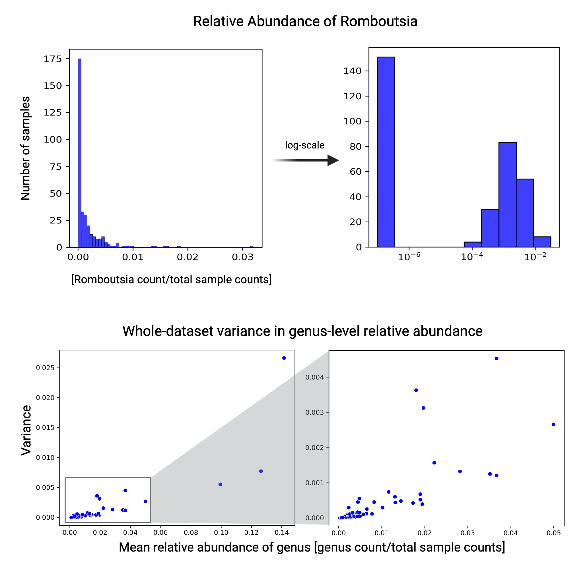
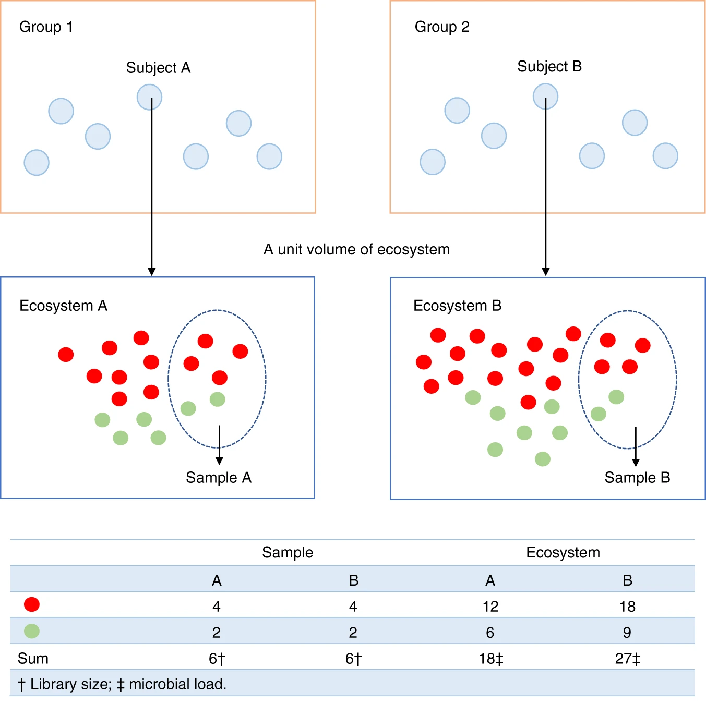
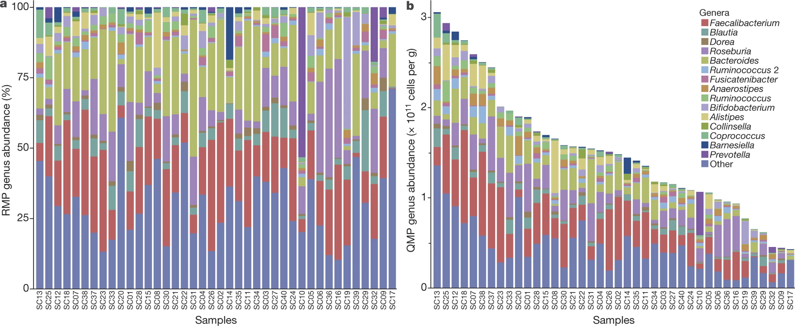

<!-- .slide: data-background="assets/isb/data-midnight.jpg" class="dark" -->

# Amplicon Sequencing Data Analysis with QIIME 2

### Alyssa Easton, Gibbons Lab

from the *ISB Microbiome Course 2024*

 

<a href="https://creativecommons.org/licenses/by-nc/4.0/"><i class="fa fa-bullhorn"></i>CC-BY-NC</a>
<a href="https://gibbons.isbscience.org/"><i class="fa fa-globe"></i>gibbons.isbscience.org</a>
<a href="https://github.com/gibbons-lab"><i class="fa fa-github"></i>gibbons-lab</a>
<a href="https://www.linkedin.com/in/alyssa-n-easton-7692b4175"><i class="fa fa-linkedin"></i>Alyssa N Easton</a>

---

## Let's Start Learning :books:

First, we'll need the slides, full of _digestible_ information

*https://gibbons-lab.github.io/isb_course_2024/16S*

---

<!-- .slide: data-background="var(--primary)" class="dark" -->

# Organization of the course

---

## Guts, Camera, Action :movie_camera:

📕 Let's switch to the notebook and get started. Step 1: save a copy of this notebook in your Google Drive.

 

In case you get lost, *all* output we generate can be found on [Github](https://github.com/Gibbons-Lab/isb_course_2024/tree/main/treasure_chest), or in `materials/treasure_chest` in Colab.

---

## The Gut Microbiome 🦠

- 30-40 trillion bacterial cells
- Heterogenous between individuals
- Helps digest food and produces metabolites
- Affects our entire body, including the brain 🧠

 

---

## The Gut-Brain Axis

created with *BioRender.com*

---

## Why Parkinson's Disease?

Parkinson's Disease (PD) is the *second* most common neurodegenerative disorder, estimated to affect *3* people per *1,000*.
- PD characterized by degeneration of *dopaminergic* neurons, leading to motor impairment
- Aggregation of alpha-synuclein leads to cell death and, more broadly, neuroinflammation

Motor symptoms are often *preceded* by gastrointestinal symptoms.
- PD patients have increased gut epithelial permeability and inflammation
- The gut microbiota have been shown to affect motor deficits and neuroinflammation in animal models of PD

Add citations - mostly from [meta-analysis](https://www.nature.com/articles/s41531-021-00156-z)

---

## Analyzing gut microbial composition in Parkinson's Disease (PD)

In a 2017 [study](https://movementdisorders.onlinelibrary.wiley.com/doi/10.1002/mds.26942), *Hill-Burns et. al.* performed 16S rRNA sequencing of DNA extracted from the stool of 197 PD cases and 130 controls. Using tools like QIIME, they identified small but significant effects of Parkinson's Disease and common PD medications on the gut microbiome. 

[Free full-text manuscript available at Europe PMC](https://europepmc.org/article/PMC/5469442)

This data was later included in a 2021 [meta-analysis](https://www.nature.com/articles/s41531-021-00156-z) of PD-microbiome data

Today, we'll look at a *small subset* of the original data: 5 Parkinson's Disease patients and 5 healthy controls.

---

## Measuring Your Microbes

How do we see what is in the microbiome?

- Hundreds to thousands of taxa in each person
- Difficult to culture outside the resident environment
- We can *sequence* their DNA instead

---

## What will we do today?

---

# QIIME 2: Quantitative Insights into Microbial Ecology

Pronounced like *chime* 🔔

Created ~2010 during the Human Microbiome Project (2007 - 2016) under the leadership
of Greg Caporaso and Rob Knight.

> *QIIME 2* is a powerful, extensible, and decentralized microbiome
analysis package with a focus on data processing and analysis transparency.

QIIME 2 comes with a lot of help, including a wide range of [tutorials](https://docs.qiime2.org/2024.5/tutorials/),
[general documentation](https://docs.qiime2.org/2024.5/) and a [user forum](https://forum.qiime2.org/) where you can ask questions.

---

## But what is QIIME2, really?

Essentially, QIIME 2 is a set of *commands* to transform microbiome *data* into
*intermediate outputs* and *visualizations*.

It's commonly used via the *command line*. We'll use it within the Colab Notebook.

---

## QIIME2 Workflow

When we run a QIIME2 command, we specify the inputs and *action* to perform, and QIIME2 will output *artifacts* (.qza) and/or *visualizations* (.qzv).

https://docs.qiime2.org/2024.5/concepts/
https://docs.qiime2.org/2024.5/tutorials/overview/

---

## Let's make an artifact

To start, we'll import our raw data into QIIME as an *artifact*.

:computer: Let's switch to the notebook and get started

---

## What is amplicon sequencing?

---

## Why the 16S gene?

The 16S gene is *universal* and contains interspersed conserved regions perfect for *PCR* priming and hypervariable regions with *phylogenetic heterogeneity*. Our data used the V4 region. 

The V4-specific primers used in this study were F515/R806. How long is the amplified fragment, and how long are the reads?

---

## Errors during PCR and sequencing generate *noise*

PCR errors including polymerase substitution errors and chimerism are amplified over PCR cycles. Further, next generation sequencing still produces errors.

---

## DADA2 to the rescue!

We just ran the DADA2 plugin for QIIME, which is doing 4 things:

1. *filter and trim* the reads
    a. trim low quality regions
    b. remove reads with low average quality
    c. remove reads with ambiguous bases (Ns)
    d. remove PhiX (added to sequencing)
2. find the most likely *original sequences* in the sample (*ASVs*)
3. remove chimeras
4. count the abundances

---

## Identifying Amplicon Sequence Variants (ASVs)

Expectation-Maximization (EM) algorithm simultaneously assigns ASVs and models error.

The EM framework of ASV assignment is an improvement to operational taxonomic unit (OTU) construction, which clusters reads that surpass a fixed similarity threshold (often 97%). More information on these methods can be found [here](https://www.nature.com/articles/ismej2017119).

---

DADA2 output a table  now have a table containing the counts for each ASV in each sample.
We also have a list of ASVs.

 

:thinking_face: Do you have an idea for what we could do with those two data sets? What quantities
might we be interested in?

---

<!-- .slide: data-background="var(--primary)" class="dark" -->

## Diversity metrics

In microbial community analysis we are usually interested in two different families of diversity metrics,
*alpha diversity* (ecological diversity within a sample) and *beta diversity* (ecological differences between samples).

---

## Alpha diversity

How diverse is a single sample?

- *richness:* how many taxa do we observe (richness)? 
  → #observed taxa
- *evenness*: how evenly are abundances distributed across taxa? 
  → Evenness index
- *mixtures*: metrics that combine both richness and evenness 
  → Shannon Index, Simpson's Index

Each sample has *1* Shannon Index.

---

## Beta diversity

How different are two or more samples/donors/sites from one another other?

- *unweighted:* how many taxa are *shared* between samples? 
  → Jaccard index, unweighted UniFrac
- *weighted:* do shared taxa have *similar abundances*? 
  → Bray-Curtis distance, weighted UniFrac

Each sample has *n* Bray-Curtis distances, where n = number of samples.
Therefore, beta-diversity is a *matrix*

---

### UniFrac

Do samples share *genetically similar* taxa?
UniFrac distance = branch length

Weighted UniFrac *scales* branches by *abundance*, so the presence of one distant member does not skew diversity.

---

## How to build a phylogenetic tree?

One of the basic things we might want to look at is how the sequences across
all samples are related to one another. That is, we are often interested in their *phylogeny*.

Phylogenetic trees are built from *multiple sequence alignments* and sequences are
arranged by *sequence similarity* (branch length).

Let's make one!

---

## Statistical tests for alpha diversity

Alpha diversity can be treated as any other sample measurement and is suitable for classic
univariate tests (t-test, Mann-Whitney U test).

---

## Principal Coordinate Analysis

---

## Statistical tests for beta diversity

More complicated. Usually not normal and very heterogeneous. PERMANOVA can deal with that.

---

<!-- .slide: data-background="var(--primary)" class="dark" -->

## Run the diversity analyses

:computer: Let's switch to the notebook and calculate the diversity metrics

---

<!-- .slide: data-background="var(--primary)" class="dark" -->

## But what organisms are there in our sample?

We are still just working with sequences and have no idea what *organisms*
they correspond to.

 

:thinking_face: What would you do to go from a sequence to an organism's name?

---

## Taxonomic ranks

---

Even though directly aligning our sequences to a *database of known genes*
seems most intuitive, this does not always work well in practice. Why?

---

## Multinomial Naive Bayes

Instead, use *subsequences (k-mers)* and their counts to *predict* the
lineage/taxonomy with *machine learning* methods. For 16S amplicon fragments this
often provides better *generalization* and faster results.

---

<!-- .slide: data-background="var(--primary)" class="dark" -->

## Let's assign taxonomy to the sequences

:computer: Let's switch to the notebook and assign taxonomy to our ASVs

---

<!-- .slide: data-background="var(--primary)" class="dark" -->

# Differential Abundance Analysis

How do we know if relative abundance is significantly different between groups?

---

## What taxonomic level should we use?

16S rRNA amplicon sequencing generally has good resolution at the *genus* level.

---

## What statistical tests can we use? 

After all that work, it would be nice if we could just do a t-test. But that would be a bad idea.

Let's talk about why, and what we can do about it.

---

## Relative abundance data structure

Microbiome relative abundance data is:
- not normally distributed
- zero-inflated
- overdispersed: variance not constant
- compositional: features not independent
- *biased*

These features violate the assumptions of most statistical tests (including non-parametric).

---

## Sequencing is a *random sample* of an ecosystem

*Samples* have different *"sampling fractions"*

Figures from [Lin & Peddada 2020](https://www.nature.com/articles/s41467-020-17041-7) and [Vandeputte et. al. 2017](https://www.nature.com/articles/nature24460)

---

## However, we can still compare proportions if we *transform the data*

Show plots of transform, how it goes from weird to normal-ish

Caveats: have to either impute or discard data. Check out [this blog post](https://cduvallet.github.io/posts/2018/06/fuzzy-zeros) for more information on imputation with zero-inflated compositional data.

- Compositional data transformation using center-log-ratio

---

## After hypothesis testing, we need to *correct* our p-values

Multiple comparisons inflate the likelihood of false positives!
- How to correct for multiple testing

---

## ANCOM-BC: Differential Abundance Analysis + Bias Correction in QIIME2

- ANCOM-BC: a QIIME2-compatible DA method that controls for "sampling fraction" bias

ANCOM-BC is an R package that has been implemented as a QIIME2 plugin.
Because of this, you can run it from the command line, but it's important to be aware of its assumptions.

Let's try it out in the notebook!

---

## Historically, DA methods have lacked consensus

A 2022 [meta-analysis](https://www.nature.com/articles/s41467-022-28034-z) showed an alarming lack of consensus between DA methods. Maybe there is another bias confounding sequencing data?

---

## More bias!?

Analysis of bacterial communities with known abundances suggests that *bacterial taxa* have different *"sequencing efficiencies"*, affecting the observed proportions of ALL taxa. 
  → This could be caused by biological differences like variation in average 16S copy number, or experimental procedures 
If each taxon has a sequencing efficiency *B*, between-sample differences in actual abundance (A) get *distorted*

If we don't address these concerns, we may miss true relationships and/or draw incorrect conclusions!

Figure from [McLaren _et. al._ 2019](https://elifesciences.org/articles/46923)
Expanded manuscript [McLaren _et. al._ 2022](https://mikemc.github.io/differential-abundance-theory/v/7412a36ddb8cad3c1c0f3ff2055f5402c4a74360/index.html)
---

## But since we have *many* samples, we can *estimate* these biases

- radEmu: an R-based DA method that controls for BOTH "sampling fraction" AND "taxonomic efficiency" biases
- explanation of this method on youtube, Github has the open-access code, R-package, vignettes, preprint on arXiv

---

## Your turn

Which taxa are associated with the disease state?

---

<!-- .slide: data-background="var(--primary)" class="dark" -->

### And we are done :clap:

Alex Carr  
Jacob Cavon  
Christian Diener  
Alyssa Easton  
Karl Gaisser  
Sean Gibbons  
Crystal Perez  
Nick Quinn-Bohmann  
Noa Rappaport  

Shanna Braga 
Greg Caporaso  
Audri Hubbard  
Connor Kelly 
Allison Kudla  
Dominic Lewis  
Joe Myxter  
Thea Swanson  
Victoria Uhl 
ISB Facilities Team

# Thanks! :heart:

